# 🦠 Outbreak Prediction System

<div align="center">


**Real-time disease outbreak prediction and monitoring system powered by XGBoost machine learning**

[Features](#-features) • [Architecture](#-system-architecture) • [Quick Start](#-quick-start) • [API Docs](#-api-documentation) • [Contributing](#-contributing)

</div>

---

## 📋 Overview

The Outbreak Prediction System is a production-ready full-stack application that leverages machine learning to predict disease outbreaks in real-time. It combines a FastAPI backend with WebSocket capabilities and a React-based dashboard to provide live monitoring and early warning alerts for public health officials.

### Key Capabilities

- **Real-time Predictions**: Generates outbreak predictions every 10 seconds
- **Multi-District Monitoring**: Tracks 10+ districts simultaneously
- **Intelligent Alerts**: Automatic notifications when outbreak probability exceeds thresholds
- **35 Feature Integration**: Combines weather, demographic, WASH, and epidemiological data

---

## ✨ Features

| Feature | Description |
|---------|-------------|
| 🔮 **ML-Powered Predictions** | XGBoost model trained on historical outbreak data |
| 🌐 **Real-time WebSocket** | Live data streaming to all connected clients |
| 📊 **Interactive Dashboard** | District-level visualization with probability gauges |
| 🚨 **Smart Alerts** | Toast notifications for detected outbreaks |
| 📱 **Responsive Design** | Mobile-friendly interface with adaptive layouts |
| 📋 **Live Logging** | Scrollable prediction history for debugging |
| 🔄 **Auto-Reconnection** | Resilient WebSocket connection handling |

---

## 🏗 System Architecture

### High-Level Architecture


### System Architecture


### Low-Level Design


### Data Flow Architecture


---

## 🛠 Technology Stack

### Backend
| Technology | Purpose |
|------------|---------|
| **Python 3.10+** | Core runtime |
| **FastAPI** | High-performance async API framework |
| **Uvicorn** | ASGI server with WebSocket support |
| **XGBoost** | Gradient boosting ML model |
| **Pydantic** | Data validation and settings |
| **NumPy** | Numerical computations |

### Frontend
| Technology | Purpose |
|------------|---------|
| **React 18** | UI component library |
| **TypeScript** | Type-safe JavaScript |
| **Vite** | Next-gen build tool |
| **TailwindCSS** | Utility-first styling |
| **WebSocket API** | Real-time communication |

---

## 📁 Project Structure

```
outbreak-prediction-system/
├── backend/
│   ├── app.py                      # FastAPI application entry point
│   ├── config.py                   # Feature order & configuration
│   ├── requirements.txt            # Python dependencies
│   ├── README.md                   # Backend documentation
│   ├── model/
│   │   └── xgb_log_target.model    # XGBoost model (user-provided)
│   └── services/
│       ├── __init__.py
│       ├── model_service.py        # Model loading & inference
│       ├── simulation_service.py   # Data generation with lag state
│       ├── prediction_service.py   # Prediction orchestration
│       └── websocket_manager.py    # WebSocket client handling
│
├── frontend/
│   ├── src/
│   │   ├── components/
│   │   │   ├── Dashboard.tsx       # Main prediction grid
│   │   │   ├── DistrictCard.tsx    # Individual district display
│   │   │   ├── NotificationSystem.tsx  # Outbreak alerts
│   │   │   └── LiveLogViewer.tsx   # Prediction history
│   │   ├── hooks/
│   │   │   └── useWebSocket.ts     # WebSocket connection hook
│   │   ├── utils/
│   │   │   ├── types.ts            # TypeScript interfaces
│   │   │   └── constants.ts        # Configuration & helpers
│   │   ├── App.tsx                 # Root component
│   │   ├── main.tsx                # Entry point
│   │   └── index.css               # Global styles
│   ├── index.html
│   ├── package.json
│   ├── vite.config.ts
│   └── README.md
│
└── README.md                       # This file
```

---

## 🚀 Quick Start

### Prerequisites

- Python 3.10+
- Node.js 18+
- npm or yarn

### Backend Setup

```bash
# Navigate to backend
cd backend

# Create virtual environment
python -m venv venv

# Activate (Windows)
venv\Scripts\activate
# Activate (macOS/Linux)
source venv/bin/activate

# Install dependencies
pip install -r requirements.txt

# Place your trained model
# Copy xgb_log_target.model to backend/model/

# Start server
uvicorn app:app --reload --port 8000
```

### Frontend Setup

```bash
# Navigate to frontend
cd frontend

# Install dependencies
npm install

# Start development server
npm run dev

# Open http://localhost:5173
```

---

## 📡 API Documentation

### REST Endpoints

#### `GET /`
Returns API information and available endpoints.

**Response:**
```json
{
  "name": "Outbreak Prediction System",
  "version": "1.0.0",
  "endpoints": {
    "metadata": "/metadata",
    "websocket": "/ws"
  }
}
```

#### `GET /metadata`
Returns model configuration and system status.

**Response:**
```json
{
  "feature_list": ["prev_avg_temp", "prev_avg_precipitation", ...],
  "model_version": "xgb_log_target",
  "refresh_interval": 10,
  "model_loaded": true,
  "districts": ["ballari", "bengaluru_urban", ...],
  "active_connections": 3
}
```

#### `GET /health`
Health check endpoint for monitoring.

**Response:**
```json
{
  "status": "healthy",
  "model_loaded": true,
  "active_connections": 3
}
```

### WebSocket Endpoint

#### `WS /ws`
Real-time prediction stream.

**Connection:**
```javascript
const ws = new WebSocket('ws://localhost:8000/ws');
```

**Message Types:**

1. **Connection Established**
```json
{
  "type": "connection_established",
  "message": "Connected to Outbreak Prediction System",
  "refresh_interval": 10
}
```

2. **Batch Prediction** (every 10 seconds)
```json
{
  "type": "batch_prediction",
  "items": [
    {
      "ts": "2025-12-05T18:00:00Z",
      "district": "ballari",
      "predicted_log": 2.557,
      "predicted_cases": 11.86,
      "predicted_cases_rounded": 12,
      "outbreak_prob": 0.82,
      "outbreak_flag": true,
      "input_features": {
        "prev_avg_temp": 28.5,
        "prev_avg_humidity": 72.3,
        ...
      },
      "model_version": "xgb_log_target"
    }
  ]
}
```

---

## 📊 Model Features

The XGBoost model expects **35 features** in the following exact order:

### Weather Features (6)
| Feature | Description | Range |
|---------|-------------|-------|
| `prev_avg_temp` | Previous average temperature | 15-40°C |
| `prev_avg_precipitation` | Previous precipitation | 0-50mm |
| `prev_avg_humidity` | Previous humidity | 30-95% |
| `weekly_avg_temp` | Weekly temperature average | 15-40°C |
| `weekly_avg_humidity` | Weekly humidity average | 30-95% |
| `weekly_avg_precipitation` | Weekly precipitation average | 0-50mm |

### Lag Features (3)
| Feature | Description |
|---------|-------------|
| `No. of Cases_lag_1` | Cases from previous period |
| `No. of Cases_lag_2` | Cases from 2 periods ago |
| `cases_roll2` | 2-period rolling average |

### Demographic & WASH Features (19)
| Feature | Description |
|---------|-------------|
| `Number of households` | Total households |
| `Population` | District population |
| `Area` | District area (sq km) |
| `Population density` | People per sq km |
| `Population of children b/w (0-4) age` | Children 0-4 years |
| `Population of children b/w (5-9) age` | Children 5-9 years |
| `literacy rate` | Literacy percentage |
| `E_coli` | E. coli count (CFU/100ml) |
| `Total_Coliform` | Total coliform count |
| *...and 10 more WASH indicators* | |

### Disease One-Hot Encoding (8)
| Feature | Disease Type |
|---------|--------------|
| `Disease_nan` | Unknown/None |
| `Disease_Cholera` | Cholera |
| `Disease_Acute Diarrheal Disease` | Acute Diarrhea |
| `Disease_Food Poisoning` | Food Poisoning |
| `Disease_Human Rabies` | Human Rabies |
| `Disease_Dengue` | Dengue Fever |
| `Disease_Zika Virus` | Zika Virus |
| `Disease_Kyasanur Forest Disease` | KFD |

---

## ⚙️ Configuration

### Backend Configuration (`config.py`)

```python
# Prediction interval
REFRESH_INTERVAL = 10  # seconds

# Outbreak thresholds
OUTBREAK_CASE_THRESHOLD = 10
OUTBREAK_PROB_THRESHOLD = 0.6

# Model path
MODEL_PATH = Path(__file__).parent / "model" / "xgb_log_target.model"
```

### Frontend Configuration (`.env`)

```env
VITE_WS_URL=ws://localhost:8000/ws
VITE_API_URL=http://localhost:8000
```

---

## 🎨 UI Components

### Dashboard
- Header with connection status and last update time
- Stats bar showing district count and active outbreaks
- Responsive grid of district cards

### District Card
- District name with outbreak badge
- Predicted case count (large display)
- Outbreak probability bar with color coding
- Last updated timestamp

### Notification System
- Toast-style alerts for outbreaks
- Auto-dismiss after 5 seconds
- Manual dismiss option
- Progress bar indicator

### Live Log Viewer
- Scrollable prediction history
- Auto-scroll toggle
- Clear logs button
- Color-coded by outbreak status

---

## 🔧 Development

### Running Tests

```bash
# Backend
cd backend
pytest tests/

# Frontend
cd frontend
npm run test
```

### Building for Production

```bash
# Frontend
cd frontend
npm run build
# Output in dist/

# Backend
# Use production ASGI server
uvicorn app:app --host 0.0.0.0 --port 8000 --workers 4
```

### Linting

```bash
# Backend
pip install flake8 black
flake8 backend/
black backend/

# Frontend
npm run lint
```

---

## 🚨 Outbreak Detection Logic

```mermaid
flowchart TD
    A[Predicted Cases] --> B{cases > 10?}
    A --> C[Calculate Probability]
    C --> D{prob > 0.6?}
    
    B -->|Yes| E[outbreak_flag = true]
    B -->|No| F{prob > 0.6?}
    
    D -->|Yes| E
    D -->|No| G[outbreak_flag = false]
    
    F -->|Yes| E
    F -->|No| G
    
    E --> H[🚨 Trigger Alert]
    G --> I[Normal Status]
    
    style E fill:#dc2626,color:#fff
    style H fill:#dc2626,color:#fff
    style G fill:#10b981,color:#fff
    style I fill:#10b981,color:#fff
```



---

## 🤝 Contributing

1. Fork the repository
2. Create a feature branch (`git checkout -b feature/amazing-feature`)
3. Commit changes (`git commit -m 'Add amazing feature'`)
4. Push to branch (`git push origin feature/amazing-feature`)
5. Open a Pull Request

### Code Style
- Backend: Follow PEP 8, use Black for formatting
- Frontend: Follow ESLint rules, use Prettier

---

## 📄 License

This project is licensed under the MIT License - see the [LICENSE](LICENSE) file for details.

---

## 🙏 Acknowledgments

- XGBoost team for the gradient boosting framework
- FastAPI for the high-performance web framework
- React team for the UI library
- TailwindCSS for the utility-first CSS framework

---

<div align="center">
  <sub>Built with ❤️ for public health monitoring</sub>
</div>
